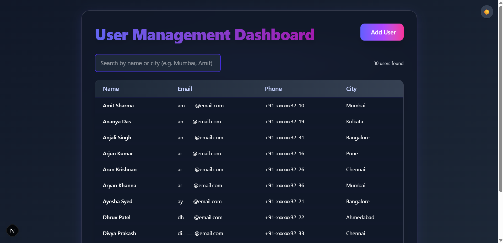

# User Management Dashboard 🚀



A modern, full-stack user management dashboard built with **Next.js 13+ (App Router)**, **TypeScript**, and **Tailwind CSS**. Effortlessly view, add, and delete users with a beautiful UI, persistent form progress, and a dark mode-first experience.

---

## ✨ Features

- 🧑‍💼 **User List**: View all users in a sortable, paginated table.
- 🔍 **Search**: Instantly filter users by name or city.
- 📝 **Add User**: Multi-step form with validation and persistent progress (localStorage).
- 👁️‍🗨️ **User Details Modal**: View user details in a modal with delete functionality.
- 🔒 **Privacy**: Email and phone are masked in the table, full details in the modal.
- ⚡ **API Routes**: Next.js API routes for user CRUD operations (in-memory store).
- 🌙 **Dark Mode**: Dark theme is default; users can toggle to light mode.
- 📱 **Responsive Design**: Works great on desktop and mobile.
- 🧑🏽‍🤝‍🧑🏾 **Sample Data**: 30 diverse users included by default.

---

## 🛠️ Tech Stack

- [Next.js 13+ (App Router)](https://nextjs.org/)
- [TypeScript](https://www.typescriptlang.org/)
- [Tailwind CSS](https://tailwindcss.com/)
- [Framer Motion](https://www.framer.com/motion/) (animations)
- [react-hot-toast](https://react-hot-toast.com/) (notifications)

---

## 🚦 Getting Started

### Prerequisites
- Node.js 18+
- npm or yarn

### Installation

```bash
# Clone the repository
git clone https://github.com/your-username/user-management-dashboard.git
cd user-management-dashboard

# Install dependencies
npm install
# or
yarn install
```

### Running the App

```bash
npm run dev
# or
yarn dev
```

Visit [http://localhost:3000](http://localhost:3000) to view the dashboard.

---

## 🗂️ Project Structure

```
user-management-dashboard/
├── src/
│   ├── app/
│   │   ├── api/users/route.ts         # API routes for user CRUD
│   │   ├── components/UserDetailModal.tsx
│   │   ├── dashboard/page.tsx         # Dashboard (user list)
│   │   ├── dashboard/add/page.tsx     # Add user form
│   │   ├── ThemeToggle.tsx            # Theme toggle button
│   │   ├── layout.tsx                 # App layout
│   │   └── page.tsx                   # Root page (redirects to dashboard)
│   └── types/user.ts                  # User type definitions
├── public/                            # Static assets
├── next.config.ts                     # Next.js config
├── tailwind.config.js                 # Tailwind config
└── README.md
```

---

## 💡 Usage

- **View Users**: The dashboard displays all users. Use the search bar to filter by name or city.
- **Add User**: Click "Add User" to open the multi-step form. Progress is saved in localStorage.
- **View Details**: Click a user row to open the details modal.
- **Delete User**: In the modal, click "Delete User" to remove a user.
- **Theme**: The app starts in dark mode by default. Use the toggle in the top-right to switch themes.

---

## 🧩 Customization

- **Persistent Data**: The app uses an in-memory array for users. For production, connect to a real database.
- **Sample Data**: Edit `src/app/api/users/route.ts` to change the initial user list.
- **Styling**: Modify Tailwind classes or add your own styles in `globals.css`.

---

## 📄 License

This project is open source and available to use as per user discretion.

---

**Made with ❤️ using Next.js and Tailwind CSS.**
